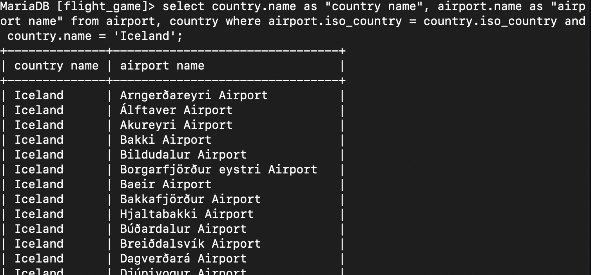

# Where-osan liitosehto harjoitukset

### Tehtävä 1
select country.name as "country name", airport.name as "airport name"
from airport, country 
where airport.iso_country = country.iso_country and country.name = 'Iceland';

