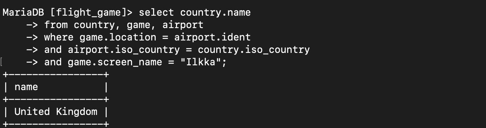
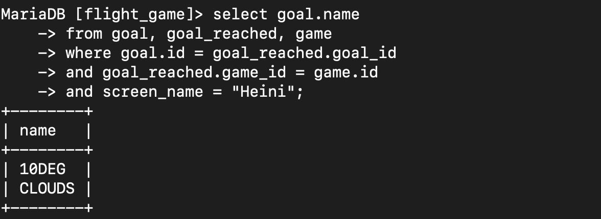

# Where-osan liitosehto harjoitukset

### Tehtävä 1
select country.name as "country name", airport.name as "airport name"
from airport, country 
where airport.iso_country = country.iso_country and country.name = 'Iceland';

### Tehtävä 2
select airport.name as "airport name" 
from airport, country
where airport.iso_country = country.iso_country 
and country.name = "France" and type = "large_airport";

### Tehtävä 3
select country.name as "country_name", airport.name as "airport_name" 
from airport, country 
where airport.iso_country = country.iso_country 
and country.continent = "AN";

### Tehtävä 4
select elevation_ft
from game, airport
where game.location = airport.ident
and screen_name = "Heini";

### Tehtävä 5
select (elevation_ft * 0.3048) as "elevation_m"
from game, airport
where game.location = airport.ident
and screen_name = "Heini";

### Tehtävä 6
select name
from airport, game
where game.location = airport.ident
and game.screen_name = "Ilkka";

### Tehtävä 7
select country.name
from country, game, airport
where game.location = airport.ident 
and airport.iso_country = country.iso_country
and game.screen_name = "Ilkka";

### Tehtävä 8
select goal.name
from goal, goal_reached, game
where goal.id = goal_reached.goal_id
and goal_reached.game_id = game.id
and screen_name = "Heini";

### Tehtävä 9

